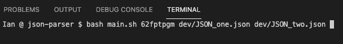

# json-parser
 Uses Python3 to produce segmented JSON files for ease of comparison. Primarily for usage in the Stanford Communities Project, but technically compatible with any JSON standard input. See the `PyInstaller` directory to install Python if you need.

 

 ## User Notes
Run `main.sh` at the command line - this is a wrapper that deploys both of the scripts outlined below. You'll receive both a reduced JSON file AND CSVs for nested keys in the provided JSONs.

    

 ### Reduced JSON

 At the command line, run `python3 reducer.py [ KEYVALUE ] [ TARGET-JSON ]`

 

 You can input as many JSON files as you like, so long as they come after the provided key value

 

   

### JSON => CSV

After reducing the JSON file using the steps above, run `python3 tabular.py [ REDUCED-JSON-FILE ]` at the command line
