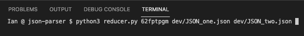

# json-parser
 Uses Python3 to produce segmented JSON files for ease of comparison. Primarily for usage in the Stanford Communities Project, but technically compatible with any JSON standard input.

 ## Installing Python

 **Unix machines** can utilize `pyinstaller.sh` in this repository (custom wrapper to install Homebrew, Python3, and Jupyter Lab in one shot)

 Alas, nothing fancy for **Windows users** (sorry!) ... see [**Python's Documentation**](https://www.python.org) to install on Windows

[**Read about Homebrew**](https://brew.sh)

 ## User Notes

 At the command line, run `python3 reducer.py [ KEYVALUE ] [ TARGET-JSON ]`

 

 The script will create an Output directory for your parsed JSON

 

 You can input as many JSON files as you like, so long as they come after the provided key value

 

